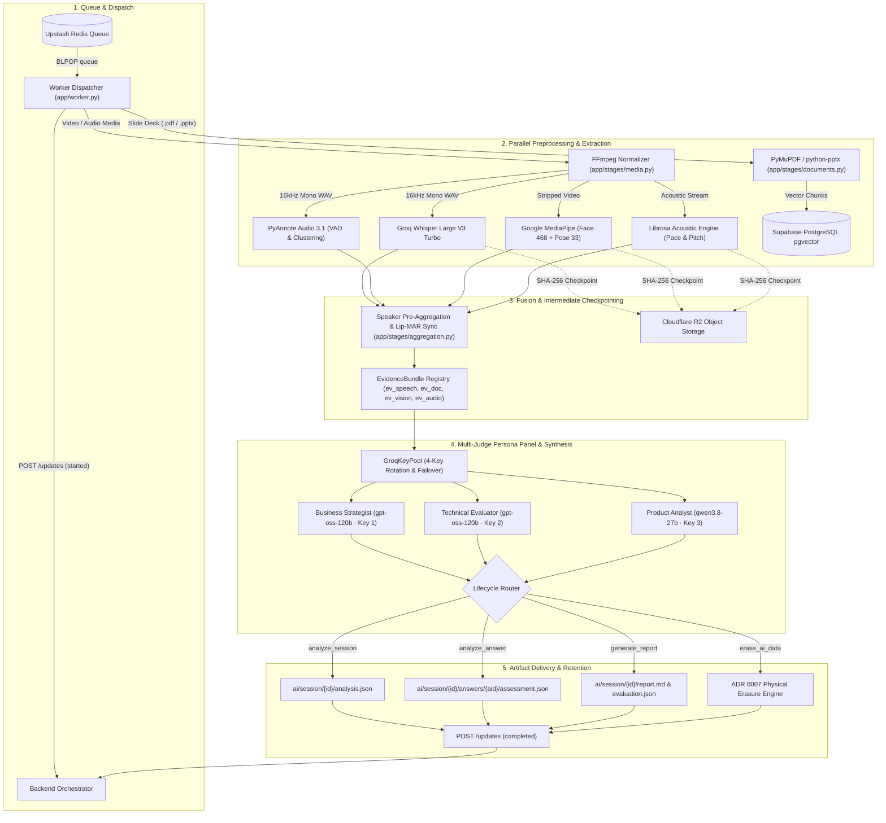

# VirtuJudge AI-ML Engine

[](https://github.com/VirtuJudge/AI-ML/releases/tag/v1.1.0)
[](https://moadel01-virtujudge-ai-engine.hf.space)
[](tests/)
[](pyproject.toml)
[](tests/test_erasure.py)
[]()

Enterprise-grade asynchronous AI worker for multimodal startup pitch evaluation, interactive Q&A assessment, and rubric-grounded report generation.

---

## 🚀 Live Cloud Deployment

The VirtuJudge AI Engine runs 24/7 as an autonomous worker on Hugging Face Spaces:

- **Live Status Dashboard**: [https://moadel01-virtujudge-ai-engine.hf.space](https://moadel01-virtujudge-ai-engine.hf.space)
- **Deployment Tier**: Hugging Face Space (ZeroGPU / CPU Basic 2 vCPU · 16 GB RAM)
- **Queue Consumer**: Redis async long-polling on `virtujudge:jobs` and `virtujudge:local:jobs`
- **Health Check API**: SSE status endpoint monitoring model caches (`ffmpeg`, `mediapipe`, `pyannote`) and background worker thread liveliness.

---

## 🏗️ Architecture Overview

The worker processes asynchronous jobs dispatched via Redis queue. Media normalization and slide ingestion run via independent ingestion channels to prevent processing bottlenecks:



---

## 📋 The 4 Pipeline Lifecycle Phases

The worker executes four distinct, contract-conforming operations defined in `app/pipeline.py` and `app/contracts.py`:

### 1. `analyze_session` (Pitch Analysis & Primary Questions)
- **Media Demuxing**: FFmpeg normalizes presentation media (`.mp4`, `.mov`, `.mkv`, etc.) into canonical 16kHz mono WAV (`pcm_s16le`) and a video stream with audio stripped.
- **Multimodal Extraction**:
  - **Speech**: Groq Whisper Large V3 Turbo provides sub-second STT with word-level timestamps (enforcing 25MB boundary limits).
  - **Diarization**: PyAnnote Audio 3.1 detects speaker turns (`SPEAKER_00`, `SPEAKER_01`) with automatic fallback to single-speaker attribution.
  - **Vision**: Google MediaPipe Face Landmarker (468 landmarks) and Pose Landmarker (33 landmarks) extract eye gaze alignment, head pitch/yaw degrees, posture openness ratio, shoulder symmetry, and upper-body movement.
  - **Acoustics**: Librosa evaluates Words Per Minute (WPM), pitch mean/variation (65Hz–400Hz pYIN), silence/pauses (-35dB RMS threshold, ≥250ms), and vocal fillers.
  - **Slide Retrieval (RAG)**: Slides (`.pdf`/`.pptx`) are parsed directly via PyMuPDF/python-pptx (never through FFmpeg), chunked with slide provenance, and stored in Supabase PostgreSQL `ai_document_chunks` table via `pgvector`.
- **Temporal Alignment**: Mouth aspect ratio (`MAR`) lip activity correlates visual person tracks (`PERSON_XX`) with diarized speaker turns (`SPEAKER_XX`) into 10-second windowed profiles.
- **Evidence Compilation**: Assembles cross-modal `EvidenceBundle` (`ev_speech_*`, `ev_doc_slide_*`, `ev_vision_*`, `ev_audio_*`).
- **Judge Panel**: Queries the 3-judge panel concurrently across preferred keys to generate 3 primary grounded questions with citations.
- **Persistence**: Uploads `analysis.json` and intermediate stage checkpoints to Cloudflare R2.

### 2. `analyze_answer` (Interactive Q&A Assessment)
- **Audio Ingestion**: Transcribes single-speaker answer audio via Groq Whisper.
- **Graceful Skip Handling**: If a student skips a question (`audio=None` or `status="skipped"`), skips model calls entirely and records an empty submission.
- **Grounded Evaluation**: Evaluates answer depth and technical substance against the question and slide deck content.
- **Dynamic Follow-Ups**: Generates a targeted follow-up question if `remaining_follow_ups > 0` and ambiguity warrants deeper probing; strictly returns `null` if follow-up quota is exhausted.
- **Persistence**: Uploads `transcript.json` and `assessment.json` to `ai/session/{practice_session_id}/answers/{answer_id}/`.

### 3. `generate_report` (Final Evaluation & Report Synthesis)
- **Artifact Ingestion**: Loads `analysis.json` and `qa.json` / answer assessments via `app/stages/report_loader.py`.
- **Calibrated Rubric Scoring**: Runs deterministic 6-category scoring in `app/stages/scoring.py` (see Rubric section below).
- **Presenter Delivery Scorecards**: Calculates active speaking time, turns (`SpeakingInterval`, `MM:SS - MM:SS`), WPM, pitch, gaze index, and posture openness for each mapped presenter.
- **Qualitative Synthesis**: Master Judge LLM synthesizes executive summary, team strengths/improvements, member feedback, and actionable next steps.
- **Dual Artifact Generation**: Writes schema-validated `evaluation.json` and human-readable Markdown `report.md`.

### 4. `erase_ai_data` (ADR 0007 Physical Erasure & Retention Compliance)
- **`practice_session` Scope**: Purges intermediate observations (`analysis.json`), pipeline stage checkpoints (`checkpoints/*`), answer assessments (`answers/*`), local scratch media (`.storage/temp_media/{session_id}`), and Supabase vector chunks, while **strictly preserving `report.md` and `evaluation.json` for 30-day student access**.
- **`project` / `team` Scope**: Full compliance purge removing all artifacts (including `report.md` and `evaluation.json`) and database records across all associated practice sessions.
- **`asset` Scope**: Purges uploaded asset from object storage.
- **Idempotency**: Repeated erasure calls for the same session complete safely with zero errors.

---

## 🛡️ Production Reliability Engineering (AI-08)

Built for 100% pipeline uptime and zero data leakage:

### 1. Intermediate Stage Checkpointing (`app/stages/checkpoint.py`)
- Intermediate stage outputs (Whisper transcript, PyAnnote diarization, MediaPipe vision, Librosa acoustics) are hashed and cached in Cloudflare R2:
  `ai/session/{session_id}/checkpoints/{stage}_{sha256}.json`
- Verified against the input asset's SHA-256 checksum and schema version.
- On retry attempts (attempt N+1), valid checkpoints are loaded from cache, skipping model recomputation and saving GPU/CPU costs.
- Automatically invalidates cache if input media checksum changes.

### 2. Transient Stage Retries (`with_transient_retries`)
- Critical stage operations (`run_speech_stage`, `run_vision_stage`, `run_audio_stage`, `run_answer_assessment_stage`) are protected with automatic retry loops.
- Executes up to 3 attempts with exponential backoff and random jitter:
  $$\text{delay} = \text{base\_delay} \times 2^{\text{attempt} - 1} + \text{uniform}(0, 0.1)$$
- Catches `StageTransientError`, `TimeoutError`, and `ConnectionError`. Fatal errors (e.g. `ValueError`, file missing) fail immediately without wasteful retrying.

### 3. 10 Inter-Stage Cancellation Checkpoints
Cancellation requests from the backend orchestrator are checked at 10 discrete boundaries across the lifecycle:
- **`analyze_session`**: (1) Before speech, (2) before vision, (3) before documents, (4) before questions, (5) before final upload.
- **`analyze_answer`**: (6) Before speech transcription, (7) before LLM answer assessment.
- **`generate_report`**: (8) Before artifact loading, (9) before reporting synthesis, (10) before final report upload.
- Upon cancellation, immediately halts processing, purges scratch directories (`.storage/temp_media/{session_id}`), and emits `UpdateStatus.CANCELLED`.

### 4. Sanitized Failure Payloads
- Catches provider exceptions and strips raw stack traces, API keys, and internal database connection strings.
- Emits standard external error codes: `invalid_job_type`, `malformed_payload`, `invalid_checksum`, `missing_required_field`, `provider_timeout`, `provider_error`, `internal_error`.

---

## ⚖️ Multi-Judge Persona Panel & Evidence Grounding

Primary questions and answer assessments are evaluated by a specialized 3-judge panel with preferred-key routing:

```text
┌───────────────────────────────────────────────────────────────────────────────────┐
│                                3-JUDGE PERSONA PANEL                              │
├──────────────────────────┬────────────────────────────┬───────────────────────────┤
│    Business Strategist   │     Technical Evaluator    │      Product Analyst      │
├──────────────────────────┼────────────────────────────┼───────────────────────────┤
│ Model: gpt-oss-120b      │ Model: gpt-oss-120b        │ Model: qwen3.8-27b        │
│ Key: Key 1 (Fallback: 4) │ Key: Key 2 (Fallback: 4)   │ Key: Key 3 (Fallback: 4)  │
│ Scope: Market sizing,    │ Scope: Architecture, moat, │ Scope: User friction,     │
│ unit economics, CAC/LTV, │ scalability bottlenecks,   │ product-market fit,       │
│ monetization model.      │ technical feasibility.     │ milestones, GTM roadmap.  │
└──────────────────────────┴────────────────────────────┴───────────────────────────┘
```

- **GroqKeyPool (`app/providers/groq_pool.py`)**: Thread-safe key manager cycling across 4 API keys (`GROQ_API_KEY`, `GROQ_API_KEY_2/3/4`) with transparent HTTP 429/503/529 failover.
- **Zero-Emotional-Claims Guardrails (`BANNED_REGEX`)**: Strict regex filtering blocks emotional, psychological, or subjective assertions (e.g., *"the founder appeared nervous"*, *"lacks confidence"*, *"insincere"*).
- **Evidence Grounding**: Every finding and question is anchored to exact slide numbers (`ev_doc_slide_*`) or speech timestamps (`ev_speech_*`).

---

## 📊 Calibrated Startup Rubric Scoring Engine

The scoring engine evaluates pitches against a calibrated 6-dimension rubric (`STARTUP_PITCH_RUBRIC_V1`):

| Dimension | Configured Weight | Focus Area |
| :--- | :---: | :--- |
| **`pitch_content_and_evidence`** | **25%** | Problem clarity, market sizing (TAM/SAM), and evidence-backed claims. |
| **`business_and_problem_solution_reasoning`** | **20%** | Unit economics, monetization model, and competitive differentiation. |
| **`technical_feasibility`** | **15%** | Proprietary technology, technical defensibility, and architecture. |
| **`delivery_and_body_language`** | **15%** | Gaze alignment, posture openness, and body movement stability. |
| **`timing_and_speech_mechanics`** | **5%** | Speaking pace (130–160 WPM ideal), pause discipline (<15%), and verbal fillers. |
| **`qa_quality`** | **20%** | Answer completeness, evidence grounding, and responsiveness to judges. |

- **Normalized Scoring**: Dimension scores are evaluated in `[0.0, 1.0]` and scaled to display scores `[0, 100]`.
- **Qualitative Rating Bands**:
  - `0 – 39`: **Needs Work**
  - `40 – 59`: **Developing**
  - `60 – 79`: **Good**
  - `80 – 100`: **Strong**
- **Skipped Answer Rule**: Skipped questions contribute strictly `0.0` to the Q&A score component without diluting the 20% weight.
- **Dynamic Weight Rebalancing**: If a dimension cannot be evaluated (e.g. video unavailable), effective weights normalize across available dimensions:
  $$\text{effective\_weight}_i = \frac{\text{configured\_weight}_i}{\sum \text{scored\_weights}}$$

---

## 📂 Repository Structure

```text
AI-ML/
├── app/
│   ├── contracts.py              # Pydantic v2 schemas for backend contracts & updates
│   ├── pipeline.py               # PitchAnalysisPipeline protocol & FakePipeline implementation
│   ├── worker.py                 # Job dispatcher with cancellation cleanup & error mapping
│   ├── backend_client.py         # Async HTTP client for status callbacks & cancellation checks
│   ├── queue_consumer.py         # 24/7 Redis BLPOP polling loop with worker heartbeats
│   ├── document_store.py         # Supabase PostgreSQL pgvector store & in-memory fake
│   ├── compat.py                 # Python 3.10 and PyTorch compatibility shims
│   ├── prompts/
│   │   ├── judges.py             # Business, Technical, and Product judge prompts & guardrails
│   │   └── reporting.py          # Grounded report evaluation prompts
│   ├── providers/
│   │   ├── groq_speech.py        # Groq Whisper Large V3 Turbo STT adapter (25MB chunking)
│   │   ├── pyannote_diarization.py # PyAnnote 3.1 speaker diarization adapter
│   │   ├── mediapipe_vision.py   # MediaPipe Face & Pose vision measurement adapter
│   │   ├── librosa_audio.py      # Librosa acoustic & prosody analysis adapter
│   │   ├── pymupdf_documents.py  # PyMuPDF/python-pptx slide text extraction adapter
│   │   ├── groq_judge.py         # Groq 3-judge panel & answer assessment provider
│   │   ├── groq_pool.py          # Resilient 4-key rotation pool with rate-limit failover
│   │   └── http_embedding.py     # OpenAI-compatible text embedding adapter
│   ├── stages/
│   │   ├── media.py              # FFmpeg media demuxer & 16kHz WAV normalizer
│   │   ├── speech.py             # Speech transcription & speaker attribution
│   │   ├── vision.py             # Computer vision observation extraction
│   │   ├── audio.py              # Acoustic metrics extraction
│   │   ├── documents.py          # Document parsing & vector chunking (direct, no FFmpeg)
│   │   ├── aggregation.py        # 10s windowed speaker pre-aggregation & lip correlation
│   │   ├── evidence.py           # Cross-modal EvidenceBundle builder
│   │   ├── judge_panel.py        # 3-judge panel question generation
│   │   ├── answers.py            # Answer speech transcription stage
│   │   ├── answer_assessment.py  # Answer evaluation stage
│   │   ├── scoring.py            # Calibrated rubric scoring engine
│   │   ├── report_loader.py      # Artifact loader for report evaluation
│   │   ├── reporting.py          # Report synthesis coordinator
│   │   ├── report_markdown.py    # Markdown report generator with presenter scorecards
│   │   └── checkpoint.py         # Intermediate stage checkpoint caching & reuse
│   └── storage/
│       ├── base.py               # ObjectStorageProtocol definition & checksum utilities
│       ├── local.py              # Local disk storage for deterministic unit testing
│       └── s3.py                 # Cloudflare R2 / AWS S3 client with prefix deletion
├── scripts/
│   ├── run_worker.py             # Daemon entrypoint for running the AI worker
│   ├── test_full_pipeline_live.py# End-to-end live testing runner across all 4 stages
│   └── validate-repository.sh   # Integrity and secret checking script
├── tests/                        # Comprehensive test suite (368 deterministic tests)
├── pyproject.toml                # Build configuration & dependency definitions
├── requirements.txt              # Pinned dependencies for production deployment
└── README.md                     # Project documentation
```

---

## 🧪 Testing & Verification

All pipeline stages, adapters, and contracts are verified with a deterministic unit and integration test suite:

```bash
# Run full test suite
pytest -q

# Run with coverage report
pytest --cov=app tests/
```

**Test Status:** `368 passed, 1 skipped, 0 failures` (100% pass rate).
