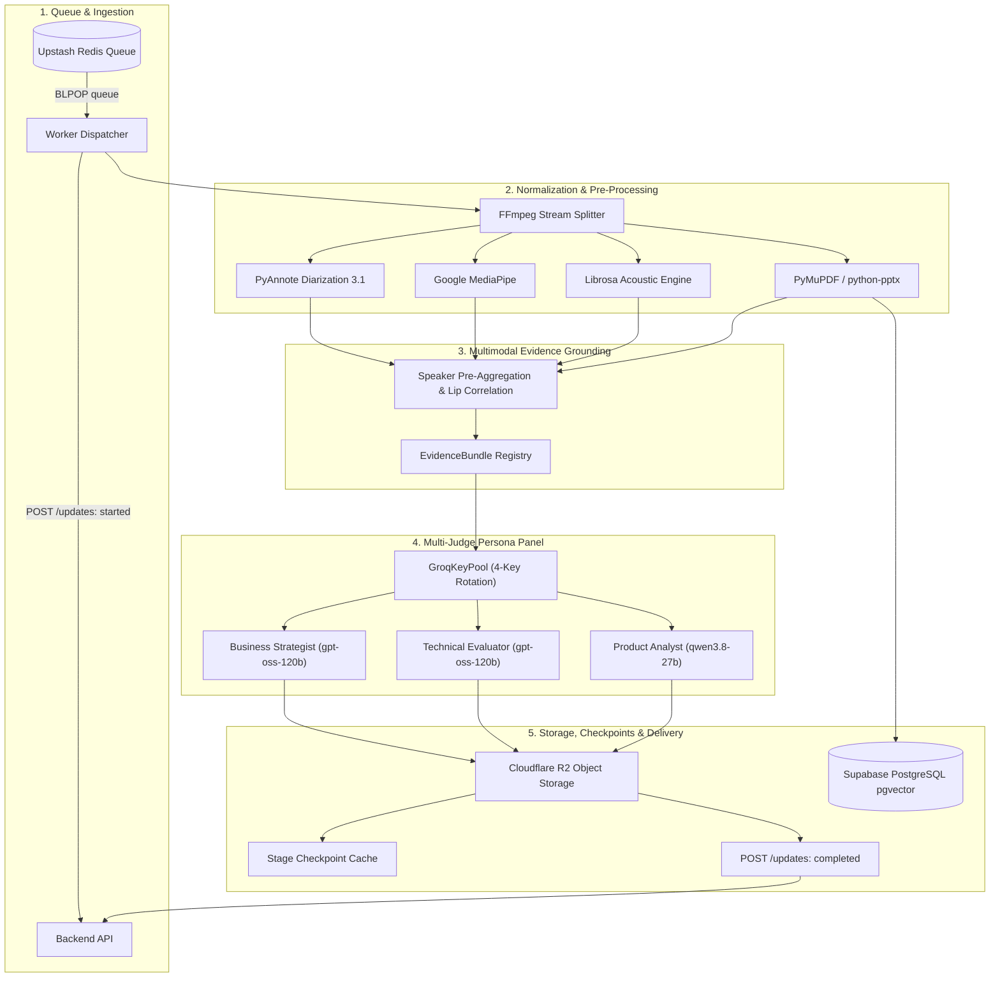

# VirtuJudge AI-ML Engine

[](https://github.com/VirtuJudge/AI-ML/releases/tag/v1.1.0)
[](https://moadel01-virtujudge-ai-engine.hf.space)
[](tests/)
[](pyproject.toml)
[]()

Enterprise-grade asynchronous AI worker for multimodal startup pitch evaluation, interactive Q&A assessment, and rubric-grounded report generation.

---

## 🚀 Live Cloud Deployment

The VirtuJudge AI Engine runs 24/7 as an autonomous worker on Hugging Face Spaces:

- **Live Status Dashboard**: [https://moadel01-virtujudge-ai-engine.hf.space](https://moadel01-virtujudge-ai-engine.hf.space)
- **Deployment Tier**: Hugging Face Space (ZeroGPU / CPU Basic 2 vCPU · 16 GB RAM)
- **Queue Consumer**: Redis async long-polling on `virtujudge:jobs` and `virtujudge:local:jobs`
- **Health Check API**: SSE status endpoint monitoring model caches (`ffmpeg`, `mediapipe`, `pyannote`) and background worker thread liveliness.

---

## 🏗️ Architecture Overview



---

## 🧠 Multimodal AI Stack & Technical Specifications

| Subsystem | Core Engine / Model | Implementation Details |
| :--- | :--- | :--- |
| **Media Normalization** | **FFmpeg (`app/stages/media.py`)** | Normalizes arbitrary media containers (`.mp4`, `.webm`, `.mov`, `.mkv`, etc.) to canonical 16kHz, single-channel, 16-bit PCM WAV (`pcm_s16le`) upfront to prevent repeated downstream conversions. |
| **Speech Transcription** | **Groq Whisper Large V3 Turbo (`app/providers/groq_speech.py`)** | Sub-second OpenAI-compatible speech-to-text API delivering word-level timestamps and punctuation. Enforces strict 25MB file chunk boundaries. |
| **Speaker Diarization** | **PyAnnote Audio 3.1 (`app/providers/pyannote_diarization.py`)** | Neural Voice Activity Detection (VAD) and speaker clustering for presenter turn segmentation (`SPEAKER_00`, `SPEAKER_01`) with automatic single-speaker fallback. |
| **Computer Vision** | **Google MediaPipe (`app/providers/mediapipe_vision.py`)** | Dual-model tracking: Face Landmarker (468 3D landmarks, float16) and Pose Landmarker Lite/Heavy (33 body landmarks). Measures eye gaze alignment, head pitch/yaw pose degrees, posture openness ratio, shoulder symmetry, and upper-body movement (px). Zero subjective or emotional inferences. |
| **Acoustic & Prosody** | **Librosa & SoundFile (`app/providers/librosa_audio.py`)** | Parabolic interpolation pitch tracking (65 Hz–400 Hz range), speaking tempo in Words Per Minute (WPM), speech-to-pause ratios with a -35 dB RMS silence threshold, and verbal filler frequency tracking. |
| **Speaker Fusion** | **Lip Activity + Turn Alignment (`app/stages/aggregation.py`)** | Cross-correlates mouth aspect ratio (`MAR`) with audio turn intervals to resolve presenter identity across camera angles and cuts into 10-second windowed profiles. |
| **Document Retrieval (RAG)** | **PyMuPDF, `python-pptx` & Supabase `pgvector` (`app/document_store.py`)** | Slide deck text parsing with exact page provenance and character offsets. Stores vector embeddings in Supabase PostgreSQL (`ai_document_chunks`) using `asyncpg` with SSL and cosine similarity retrieval. |
| **LLM Reasoning** | **Groq LPU Cloud (`app/providers/groq_judge.py`)** | High-throughput inference using `openai/gpt-oss-120b` and `qwen/qwen3.8-27b` with structured JSON output enforcement and zero-emotional-claims guardrails. |
| **Key Pool Management** | **GroqKeyPool (`app/providers/groq_pool.py`)** | Thread-safe, coroutine-safe key pool cycling across 4 API keys with preferred-key routing per judge persona and transparent HTTP 429/529 failover. |
| **Object Storage** | **Cloudflare R2 / S3 (`app/storage/`)** | S3-compatible cloud storage with streaming multi-part uploads, prefix deletion, and retention isolation (`ai/session/{session_id}/*`). |
| **Queue & Messaging** | **Upstash Redis (`app/queue_consumer.py`)** | Long-polling consumer daemon (`BLPOP`) with distributed worker heartbeat tracking and status callbacks. |

---

## 📋 Pipeline Stages

The pipeline executes four distinct, contract-conforming operations:

### 1. `analyze_session` (Pitch Analysis & Primary Questions)
- Downloads presentation media (`.mp4`) and pitch deck (`.pdf`/`.pptx`) from Cloudflare R2.
- Demuxes audio and video streams via FFmpeg.
- Runs speech transcription, speaker diarization, visual pose tracking, acoustic prosody analysis, and slide text extraction in parallel.
- Correlates visual presenter tracks with diarization turns into 10-second aggregated windows.
- Assembles a structured `EvidenceBundle` with cross-modal IDs (`ev_speech_*`, `ev_doc_slide_*`, `ev_vision_*`, `ev_audio_*`).
- Concurrently queries the 3-judge panel to generate three grounded primary questions with specific slide and timestamp citations.
- Uploads `analysis.json` and intermediate stage checkpoints to Cloudflare R2.

### 2. `analyze_answer` (Interactive Q&A Assessment)
- Transcribes student spoken answers from interactive Q&A rounds.
- Evaluates answer substance and evidence grounding against the asked question and slide deck content.
- Respects remaining follow-up quota and handles skipped questions safely without calling model providers.
- Dynamically generates grounded follow-up questions when follow-up quota remains.
- Persists session-scoped transcript and assessment artifacts (`ai/session/{practice_session_id}/answers/{answer_id}/`).

### 3. `generate_report` (Final Evaluation & Report Synthesis)
- Executes the deterministic 6-category startup rubric scoring engine.
- Synthesizes holistic team feedback and individual presenter delivery scorecards with timestamped quote references.
- Generates structured, schema-validated `evaluation.json` and human-readable Markdown `report.md`.

### 4. `erase_ai_data` (Physical Erasure & Retention Compliance)
- Executes physical deletion of AI data adhering to **ADR 0007**:
  - **`practice_session` Scope**: Purges intermediate observations (`analysis.json`), pipeline checkpoints, Q&A assessments, local scratch media, and Supabase vector chunks while **strictly preserving `report.md` and `evaluation.json` for 30-day student access**.
  - **`project` / `team` Scope**: Complete compliance purge removing all artifacts and database records across all associated sessions.

---

## ⚖️ Multi-Judge Persona Panel & Evidence Grounding

Primary question generation and answer evaluation are driven by a specialized 3-judge panel executed concurrently with preferred-key routing:

```text
┌───────────────────────────────────────────────────────────────────────────────────┐
│                                3-JUDGE PERSONA PANEL                              │
├──────────────────────────┬────────────────────────────┬───────────────────────────┤
│    Business Strategist   │     Technical Evaluator    │      Product Analyst      │
├──────────────────────────┼────────────────────────────┼───────────────────────────┤
│ Model: gpt-oss-120b      │ Model: gpt-oss-120b        │ Model: qwen3.8-27b        │
│ Key: Key 1 (Fallback: 4) │ Key: Key 2 (Fallback: 4)   │ Key: Key 3 (Fallback: 4)  │
│ Scope: Market sizing,    │ Scope: Architecture, moat, │ Scope: User friction,     │
│ unit economics, CAC/LTV, │ scalability bottlenecks,   │ product-market fit,       │
│ monetization model.      │ technical feasibility.     │ milestones, GTM roadmap.  │
└──────────────────────────┴────────────────────────────┴───────────────────────────┘
```

- **Zero-Emotional-Claims Guardrails**: Strict regex filtering (`BANNED_REGEX`) blocks emotional, psychological, or subjective assertions (e.g., *"the founder appeared nervous"*, *"lacks confidence"*).
- **Evidence Grounding**: Every finding and question is anchored to exact slide numbers or speech timestamps from the `EvidenceBundle`.

---

## 📊 Calibrated Startup Rubric Scoring Engine

The scoring engine evaluates pitches against a calibrated 6-dimension rubric:

| Dimension | Configured Weight | Focus Area |
| :--- | :---: | :--- |
| **`pitch_content_and_evidence`** | **25%** | Problem clarity, market sizing (TAM/SAM), and evidence-backed claims. |
| **`business_and_problem_solution_reasoning`** | **20%** | Unit economics, monetization model, and competitive differentiation. |
| **`technical_feasibility`** | **15%** | Proprietary technology, technical defensibility, and architecture. |
| **`delivery_and_body_language`** | **15%** | Gaze alignment, posture openness, and body movement stability. |
| **`timing_and_speech_mechanics`** | **5%** | Speaking pace (WPM), pause discipline, and verbal filler control. |
| **`qa_quality`** | **20%** | Answer completeness, evidence grounding, and responsiveness to judges. |

- **Normalized Scoring**: Individual scores are evaluated in `[0.0, 1.0]` and scaled to display scores `[0, 100]`.
- **Qualitative Rating Bands**:
  - `0 – 39`: **Needs Work**
  - `40 – 59`: **Developing**
  - `60 – 79`: **Good**
  - `80 – 100`: **Strong**
- **Skipped Answer Rule**: Skipped questions explicitly contribute `0.0` to the Q&A score component, ensuring accurate weighting without crashing the pipeline.

---

## 🛡️ Production Reliability & Security (AI-08 / ADR 0007)

- **Transient Stage Retries**: Automatic 3-attempt exponential backoff with jitter (`with_transient_retries`) handles Groq rate limits (`429`), server errors (`503`), and network timeouts without failing the job.
- **Sanitized Failure Payloads**: Strips raw provider internals, stack traces, and database connection strings from terminal `FailedPayload` updates to ensure safe external error reporting.
- **Intermediate Stage Checkpointing**: Intermediate outputs (Whisper transcript, MediaPipe observations, Librosa metrics) are cached in Cloudflare R2 under `ai/session/{session_id}/checkpoints/{stage}_{sha256}.json`. On attempt N+1 retries, valid checkpoints are verified by SHA-256 and reused, eliminating redundant GPU/CPU costs.
- **10 Inter-Stage Cancellation Checkpoints**: Active cancellation checks throughout session analysis, answer evaluation, and report synthesis halt processing immediately if cancelled by the user, pruning scratch media (`.storage/temp_media/`) and emitting `UpdateStatus.CANCELLED`.
- **Dual Runtime Support**: Full compatibility across Python 3.10 and Python 3.11+, enabling smooth ZeroGPU execution on Hugging Face Spaces.

---

## 📂 Repository Structure

```text
AI-ML/
├── app/
│   ├── contracts.py              # Pydantic v2 schemas for backend contracts & updates
│   ├── pipeline.py               # PitchAnalysisPipeline protocol & FakePipeline implementation
│   ├── worker.py                 # Job dispatcher with cancellation cleanup & error mapping
│   ├── backend_client.py         # Async HTTP client for status callbacks & cancellation checks
│   ├── queue_consumer.py         # 24/7 Redis BLPOP polling loop with worker heartbeats
│   ├── document_store.py         # Supabase PostgreSQL pgvector store & in-memory fake
│   ├── compat.py                 # Python 3.10 and PyTorch compatibility shims
│   ├── prompts/
│   │   ├── judges.py             # Business, Technical, and Product judge prompts & guardrails
│   │   └── reporting.py          # Grounded report evaluation prompts
│   ├── providers/
│   │   ├── groq_speech.py        # Groq Whisper Large V3 Turbo STT adapter
│   │   ├── pyannote_diarization.py # PyAnnote 3.1 speaker diarization adapter
│   │   ├── mediapipe_vision.py   # MediaPipe Face & Pose vision measurement adapter
│   │   ├── librosa_audio.py      # Librosa acoustic & prosody analysis adapter
│   │   ├── pymupdf_documents.py  # PyMuPDF slide text extraction adapter
│   │   ├── groq_judge.py         # Groq 3-judge panel & answer assessment provider
│   │   └── groq_pool.py          # Resilient 4-key rotation pool with rate-limit failover
│   ├── stages/
│   │   ├── speech.py             # Speech transcription & speaker attribution
│   │   ├── vision.py             # Computer vision observation extraction
│   │   ├── audio.py              # Acoustic metrics extraction
│   │   ├── documents.py          # Document parsing & vector chunking
│   │   ├── aggregation.py        # 10s windowed speaker pre-aggregation & lip correlation
│   │   ├── evidence.py           # Cross-modal EvidenceBundle builder
│   │   ├── judge_panel.py        # 3-judge panel question generation
│   │   ├── answers.py            # Answer speech transcription stage
│   │   ├── answer_assessment.py  # Answer evaluation stage
│   │   ├── scoring.py            # Calibrated rubric scoring engine
│   │   ├── reporting.py          # Report synthesis coordinator
│   │   ├── report_markdown.py    # Markdown report generator with presenter scorecards
│   │   └── checkpoint.py         # Intermediate stage checkpoint caching & reuse
│   └── storage/
│       ├── base.py               # ObjectStorageProtocol definition
│       ├── local.py              # Local disk storage for deterministic unit testing
│       └── s3.py                 # Cloudflare R2 / AWS S3 client with prefix deletion
├── tests/                        # Comprehensive test suite (368 deterministic tests)
├── pyproject.toml                # Build configuration & dependency definitions
├── requirements.txt              # Pinned dependencies for production deployment
└── README.md                     # Project documentation
```

---

## 🧪 Testing & Verification

All pipeline stages, adapters, and contracts are verified with a deterministic unit and integration test suite:

```bash
# Run full test suite
pytest -q

# Run with coverage report
pytest --cov=app tests/
```

**Test Status:** `368 passed, 1 skipped, 0 failures` (100% pass rate).
