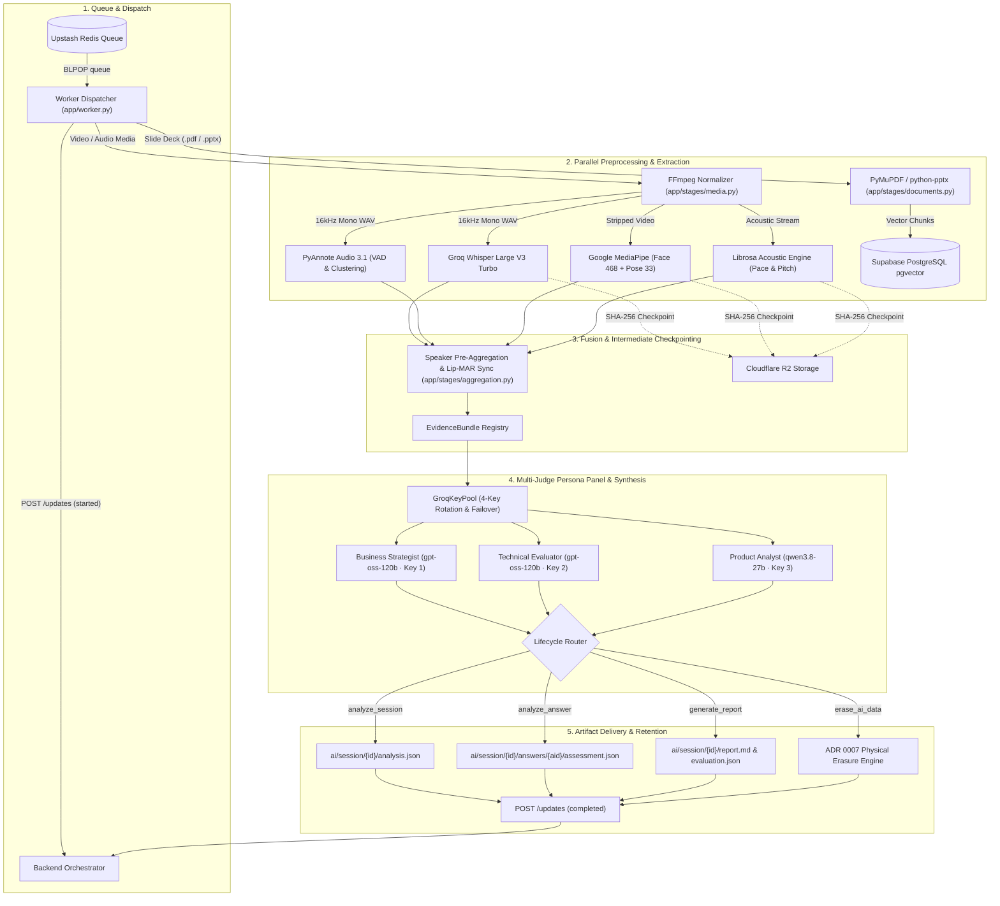

# VirtuJudge AI-ML Engine

[](https://github.com/VirtuJudge/AI-ML/releases/tag/v1.1.0)
[](https://moadel01-virtujudge-ai-engine.hf.space)
[](tests/)
[](pyproject.toml)
[](tests/test_erasure.py)
[]()

Asynchronous AI worker for multimodal startup pitch evaluation, interactive Q&A assessment, and rubric-grounded report generation.

---

## 🚀 Live Cloud Deployment

The AI Engine runs 24/7 as an autonomous worker on Hugging Face Spaces:

- **Live Status Dashboard**: [https://moadel01-virtujudge-ai-engine.hf.space](https://moadel01-virtujudge-ai-engine.hf.space)
- **Deployment Tier**: Hugging Face Space (ZeroGPU / CPU Basic 2 vCPU · 16 GB RAM)
- **Queue Consumer**: Redis async long-polling on `virtujudge:jobs` and `virtujudge:local:jobs`
- **Health Check API**: SSE status endpoint monitoring model caches and worker thread liveliness.

---

## 🏗️ Architecture Overview

Jobs are consumed from Redis and processed through modular extraction and evaluation stages:



---

## 📋 The 4 Pipeline Lifecycle Phases

Defined in `app/pipeline.py` and `app/contracts.py`:

### 1. `analyze_session` (Pitch Analysis & Questions)
- **Media Demuxing**: FFmpeg normalizes media into 16kHz mono WAV and stripped video.
- **Multimodal Extraction**:
  - **Speech**: Groq Whisper Large V3 Turbo transcription with word-level timestamps.
  - **Diarization**: PyAnnote Audio 3.1 speaker attribution (`SPEAKER_00`, `SPEAKER_01`).
  - **Vision**: MediaPipe Face & Pose landmarkers extract gaze, head pose, and posture openness.
  - **Acoustics**: Librosa measures speaking pace (WPM), pitch variation, and vocal pauses.
  - **Slide Parsing**: PyMuPDF / python-pptx extracts slide text into Supabase pgvector.
- **Evidence Aggregation**: Correlates lip activity with diarization to build speaker profiles.
- **Judge Panel**: 3-judge panel generates 3 grounded questions.
- **Output**: Uploads `analysis.json` and stage checkpoints to Cloudflare R2.

### 2. `analyze_answer` (Q&A Assessment)
- **Audio Ingestion**: Transcribes answer audio using Groq Whisper (handles skips gracefully).
- **Substantive Evaluation**: Assesses answer depth against the question and pitch materials.
- **Follow-Up Generation**: Generates targeted follow-up questions when quota remains (`remaining_follow_ups > 0`).
- **Output**: Saves `transcript.json` and `assessment.json`.

### 3. `generate_report` (Report & Feedback Synthesis)
- **Evidence Ingestion**: Aggregates `analysis.json`, Q&A transcripts, and answer assessments.
- **Calibrated Scoring**: Evaluates deterministic scores across the 6 rubric dimensions.
- **Presenter Scorecards**: Computes individual speaking time, pace, gaze, and posture metrics.
- **Qualitative Synthesis**: Master Judge synthesizes executive summaries, strengths, and recommendations.
- **Output**: Generates `evaluation.json` and Markdown `report.md`.

### 4. `erase_ai_data` (Physical Erasure & Compliance)
- **`practice_session` Scope**: Purges intermediate observations, checkpoints, scratch media, and vector chunks while preserving final reports.
- **`project` / `team` Scope**: Complete purge across all associated sessions.
- **`asset` Scope**: Deletes uploaded asset files from object storage.

---

## ⚖️ Multi-Judge Persona Panel

Primary questions and answer assessments are evaluated by a specialized 3-judge panel:

- **Business Strategist (`gpt-oss-120b`)**: Market sizing, unit economics, CAC/LTV, monetization.
- **Technical Evaluator (`gpt-oss-120b`)**: Architecture, defensibility, technical feasibility.
- **Product Analyst (`qwen3.8-27b`)**: Product-market fit, user friction, milestones, roadmap.
- **GroqKeyPool**: Resilient key manager rotating across 4 API keys with transparent 429/503 failover.
- **Guardrails**: Regex filtering suppresses subjective or emotional claims to ensure grounded, objective evaluations.

---

## 📊 Calibrated Startup Rubric Scoring Engine

Evaluates pitches against a calibrated 6-dimension rubric (`STARTUP_PITCH_RUBRIC_V1`):

| Dimension | Configured Weight | Focus Area |
| :--- | :---: | :--- |
| **`pitch_content_and_evidence`** | **25%** | Problem clarity, market sizing (TAM/SAM), and evidence-backed claims. |
| **`business_and_problem_solution_reasoning`** | **20%** | Unit economics, monetization model, and competitive differentiation. |
| **`technical_feasibility`** | **15%** | Proprietary technology, technical defensibility, and architecture. |
| **`delivery_and_body_language`** | **15%** | Gaze alignment, posture openness, and body movement stability. |
| **`timing_and_speech_mechanics`** | **5%** | Speaking pace (130–160 WPM ideal), pause discipline, and verbal fillers. |
| **`qa_quality`** | **20%** | Answer completeness, grounded reasoning, and responsiveness. |

- **Score Scaling**: Dimension scores in `[0.0, 1.0]` scale to display scores `[0, 100]`.
- **Rating Bands**: `0–39` Needs Work · `40–59` Developing · `60–79` Good · `80–100` Strong.
- **Skipped Questions**: Count as `0.0` towards Q&A score without altering rubric weights.
- **Dynamic Rebalancing**: Automatically renormalizes weights when optional media streams (e.g. video) are omitted.

---

## 📂 Repository Structure

```text
AI-ML/
├── app/
│   ├── contracts.py              # Pydantic v2 schemas for backend contracts & updates
│   ├── pipeline.py               # PitchAnalysisPipeline protocol & FakePipeline implementation
│   ├── worker.py                 # Job dispatcher with cancellation cleanup & error mapping
│   ├── backend_client.py         # Async HTTP client for status callbacks & cancellation checks
│   ├── queue_consumer.py         # 24/7 Redis BLPOP polling loop with worker heartbeats
│   ├── document_store.py         # Supabase PostgreSQL pgvector store & in-memory fake
│   ├── compat.py                 # Python 3.10 and PyTorch compatibility shims
│   ├── prompts/                  # Judge and report generation prompt templates
│   ├── providers/                # Model adapters (Groq, PyAnnote, MediaPipe, Librosa, PyMuPDF)
│   ├── stages/                   # Pipeline stages (media, speech, vision, audio, scoring, reporting)
│   └── storage/                  # Cloudflare R2 / AWS S3 and local storage clients
├── scripts/                      # Worker runners and end-to-end verification scripts
├── tests/                        # Comprehensive test suite (368 deterministic tests)
├── pyproject.toml                # Build configuration & dependency definitions
└── README.md                     # Project documentation
```

---

## 🧪 Testing & Verification

```bash
# Run test suite
pytest -q
```

**Test Status:** `368 passed, 1 skipped, 0 failures` (100% pass rate).
